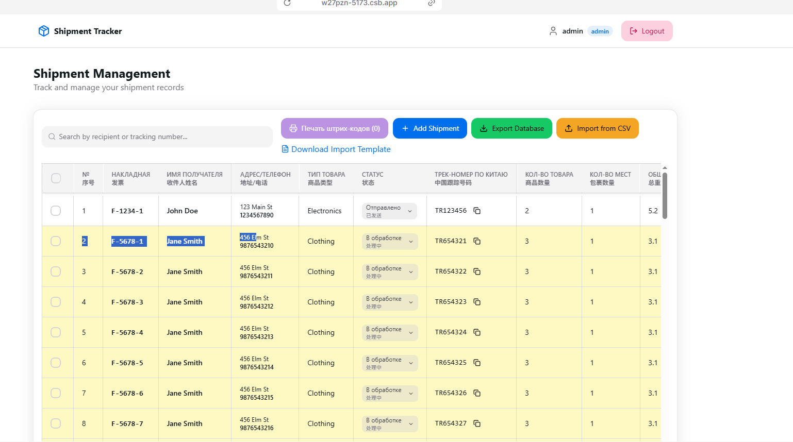

# React + Tailwind

**Shipment Management** — это веб-приложение для отслеживания и управления отправлениями. Позволяет:
- Добавлять, редактировать и удалять отправления
- Импортировать данные из CSV
- Экспортировать базу данных
- Искать и фильтровать отправления по получателю, трек-номеру и другим параметрам
- Использовать шаблон для массового импорта
- Просматривать статус, количество мест, общий вес и другую информацию по каждой посылке

Приложение построено на React, Vite и Tailwind CSS. Все данные хранятся локально в браузере пользователя.

This template provides a minimal setup to get React working in Vite with HMR and some ESLint rules. One top of the standard Vite setup, [tailwindcss](https://tailwindcss.com/) is installed and ready to be used in React components.

Additional references:

- [Getting started with Vite](https://vitejs.dev/guide/)
- [Tailwind documentation](https://tailwindcss.com/docs/installation)
